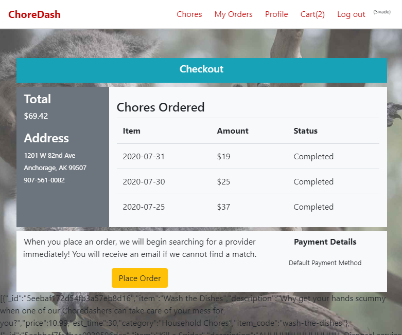
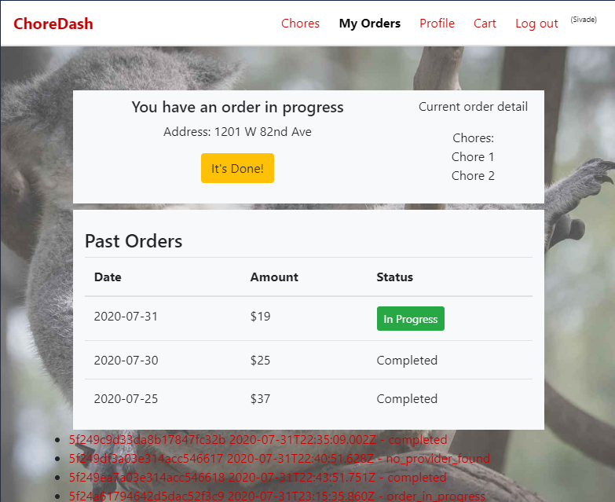
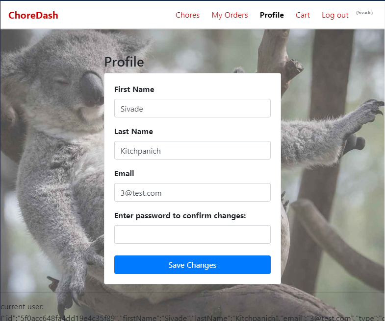
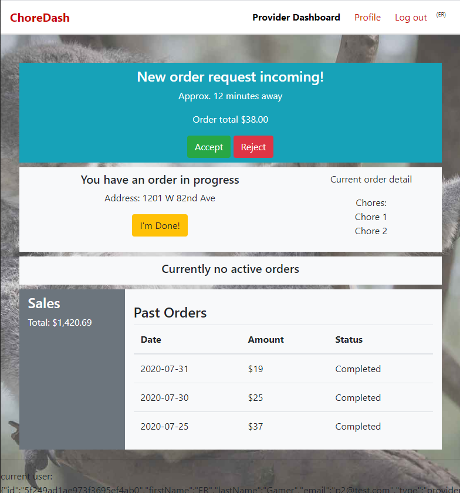
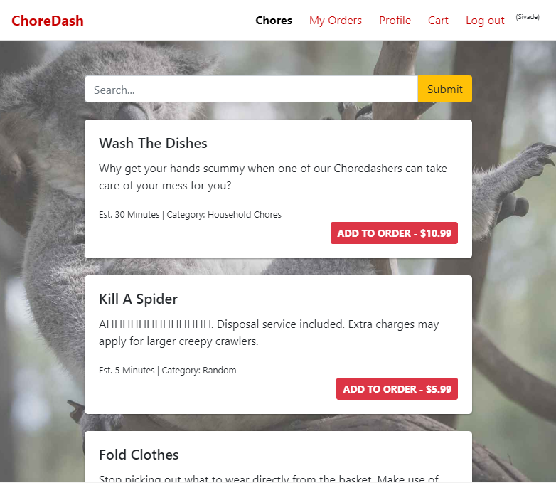

# ChoreDash React Web Client
### An instant order and dispatch queueing system for ordering services and finding the nearest available service provider.

The goal of this project was to develop a proof of concept demo for a real time ordering system. This project was inspired by apps like Uber or Doordash which provide instant location-based notifications by finding the nearest providers. This, of course, with an obviously silly twist on the product offering.

#### Major goals going into development:

- Providers are given the option to accept or deny any orders when notified within a specified time limit.
- The app runs completely server-side utilizing the Choredash API for all functionality.
- The web client is developed with a responsive design.
- Order notifications and updates are provided in real-time when a user is logged in.

## Demos







**Video demo of the dispatch system in action: https://www.youtube.com/watch?v=cnIAQPniE8E**

Front end demo: https://modest-carson-6742b1.netlify.app/

Demo API deployment: https://choredash-api-sivadej.herokuapp.com/

#### Front End Built With
- [React](#)
- [Bootstrap](#)

- Additional tools utilized: JSON Web Tokens, Axios, SASS

##### Tools used in Development
- VSCode
- Git
- Insomnia
- Google Chrome
- MongoDB Compass

## Installation
This site relies entirely on the Choredash API. A demo is deployed to https://choredash-api-sivadej.herokuapp.com/. Or, if you want to run your own backend, you can find the repo here: https://github.com/sivadej/choredash-backend.git

```
> git clone https://github.com/sivadej/choredash-frontend.git
> npm install
> npm start
```

### Dependencies
See package.json

## Authors
- Sivadej Kitchpanich - [GitHub](https://github.com/sivadej) - [Website](https://sivadej.dev)